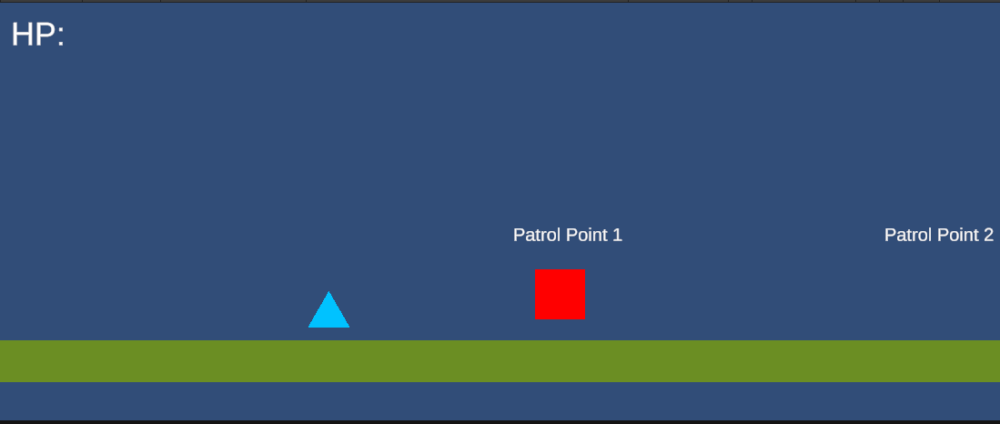

# Unity 2D Enemy AI Demo

A simple 2D enemy AI prototype built in Unity and C#.

## Gameplay Demo

> Click the image above to watch the gameplay demo.

## Features

- Enemy patrols between two points
- Player detection range
- Enemy chase behavior
- Enemy stops when entering attack range
- Attack cooldown system
- Player health system with 3 HP
- Player takes damage when attacked
- Knockback system when player is hit
- Attack range debug Gizmo
- Basic 2D Rigidbody movement

## What I Learned

- Creating simple AI states: Patrol, Chase and Attack
- Using distance checks with `Vector2.Distance`
- Moving enemies with `Vector2.MoveTowards`
- Using attack range and detection range
- Creating cooldowns with Coroutines
- Applying knockback with `Rigidbody2D`
- Displaying debug ranges with Gizmos
- Organizing a small Unity gameplay system

## Controls

- A / D or Arrow Keys: Move left/right
- Space: Jump

## Tech Used

- Unity
- C#
- Rigidbody2D
- TextMeshPro
- 
## Main Scripts

- EnemyAI.cs - handles patrol, chase, attack range and attack cooldown
- Player.cs - handles movement, jump, health and knockback
- Manager.cs - handles UI updates

## Notes

This project focuses on gameplay programming and enemy AI logic, not final art or level design.

## Project Status

Completed prototype v1.
